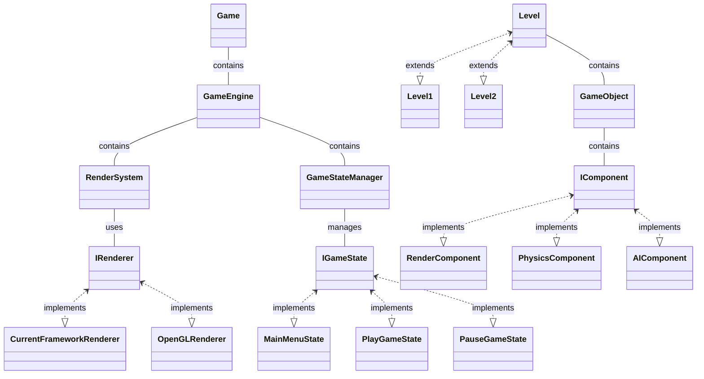

# 1. Overview

The game engine is designed to be modular, flexible, and extensible, following SOLID principles. The primary goal is to allow for the easy swapping of subsystems (like the rendering engine) and to facilitate the addition of new types of game objects and behaviors.

# 2. Architecture and Design

## Game

This is where the user will set up the main class responsible for setting up and running the game. It contains an instance of the `IGameEngine`. This will be implemented on a per project basis.

## GameEngine

The `IGameEngine` class contains instances of all the major systems used by the game, including the `IRenderer` and `IGameStateManager` and `ILogger`. It facilitates the communication between these systems.

### Properties

#### Private

- `IRenderer` `renderer`
- `IResourceManager` `resourceManager`
- `IInputHandler` `inputHandler`
- `IPhysicsEngine` `physicsEngine`
- `int privateVariable`
- …

#### Protected

- `GameStateManager` `gameStateManager`
- `Logger` `logger`
- …

#### Public

- `int publicVariable`
- …

### Methods

#### Private

- `void SomePrivateMethod()`
- …

#### Protected

- `void SomeProtectedMethod()`
- …

#### Public

- `GameEngine()` constructor
- `~GameEngine()` destructor
- `void Initialize()`
- `void Run()`
- `void Shutdown()`
- …

### Events (if any)

- (No events mentioned in previous context, but you can add them here if applicable)

Please keep in mind that the actual organization and naming might vary based on your specific implementation and design preferences.

### Methods

The `IGameEngine` interface should primarily focus on high-level orchestration and management of core engine systems. It handles aspects that affect the entire game engine, including initialization, main loop execution, resource loading, logging, and engine shutdown. The interface can provide methods for controlling and interacting with these core systems, ensuring they work in harmony.

Sure, here are the method descriptions explicitly stating where functionality will be deferred to a component of the `IGameEngine`:

| Method                                       | Description                                                                                                                                                          |
| -------------------------------------------- | -------------------------------------------------------------------------------------------------------------------------------------------------------------------- |
| `void Initialize()`                          | Initializes the game engine and core components. Actual implementation of component initialization may be deferred to injected concrete implementations.             |
| `void Run()`                                 | Starts the main game loop for updating, rendering, and input processing. The actual loop execution and subsystem handling may be implemented by injected components. |
| `void PushState(State newState)`             | Pushes a new game state onto the state stack. Delegates state management and transitions to the injected `IGameStateManager` component.                              |
| `void PopState()`                            | Pops the top game state from the stack. Delegates state management to the injected `IGameStateManager` component.                                                    |
| `void HandleInput()`                         | Polls input devices and processes user interactions. Forwards input handling to the active state or an injected `IInputHandler` component.                           |
| `void SimulatePhysics()`                     | Updates physics simulation for GameObjects with physics components. The actual physics simulation might be handled by an injected `IPhysicsEngine` component.        |
| `Resource LoadResource(string resourceName)` | Loads resources (textures, audio) with caching. Resource loading and management may be delegated to an injected `IResourceManager` component.                        |
| `void Log(string message, LogLevel level)`   | Logs messages with specified log levels. Logging details and output might be managed by an injected `ILogger` component. |
| `void Shutdown()`                            | Cleans up resources and shuts down the engine. Actual resource cleanup and shutdown sequence might be handled by injected components. |

## RenderSystem

The `RenderSystem` class is responsible for all rendering-related tasks. It utilizes an `IRenderer` to handle specific rendering tasks, allowing for different rendering backends to be swapped in and out i.e. 2D, 2.5D Ray cast, 3D (one day!). Open for extension, closed for modification.

### Interface

`IRenderer` is an interface that defines the contract for any rendering backend.

## ILogger

![[ILogger]]

## GameStateManager

The `GameStateManager` class handles the current game state and transitions between states. It works with `IGameState` instances.

## IGameState, MainMenuState, PlayGameState, PauseGameState

`IGameState` is an interface that provides the blueprint for a game state. `MainMenuState`, `PlayGameState`, and `PauseGameState` are concrete implementations of various game states.

## Level, Level1, Level2

The `Level` class holds a collection of `GameObject` instances and is responsible for updating and rendering them. `Level1`, `Level2`, etc. are unique configurations of game objects that represent different levels of the game.

## GameObject

The `GameObject` class represents a game entity. It maintains a collection of `IComponent` instances, which encapsulate different behaviors of the game object.

## IComponent, RenderComponent, PhysicsComponent, AIComponent

`IComponent` is an interface that defines a component's basic functionality. `RenderComponent`, `PhysicsComponent`, `AIComponent` are concrete implementations of this interface, handling rendering, physics, and AI respectively.

---

This design document provides an overview of the main parts of the game engine. You may need to expand it with additional details such as how objects are loaded, how events are handled, how assets are managed, etc., based on the specific requirements of your game.

# Initialization Phase

- [x] Implement the `Game` class with a basic game loop.
- [x] Set up `GameEngine` as a central hub for your game systems.
- [x] Create a basic `GameStateManager` class.

# Rendering System

- [x] Define an `IRenderer` interface with basic rendering operations.
- [ ] Implement a `RenderSystem` that uses an `IRenderer`.
- [ ] Create a `CurrentFrameworkRenderer` class that implements `IRenderer`.

# Game State Management

- [ ] Define an `IGameState` interface for game states.
- [ ] Create `MainMenuState`, `PlayGameState`, `PauseGameState` classes that implement `IGameState`.
- [ ] Extend `GameStateManager` to handle switching between these states.

# Game Object and Component System

- [ ] Define an `IComponent` interface with `OnUpdate` and `OnRender` methods.
- [ ] Create a `GameObject` class that can hold and manage `IComponent` instances.
- [ ] Implement `RenderComponent`, `PhysicsComponent`, `AIComponent` classes that implement `IComponent`.

# Level Management

- [ ] Implement a `Level` class that manages a collection of `GameObject` instances.
- [ ] Create `Level1` and `Level2` classes that inherit from `Level` and populate them with game objects.

# Player and Enemy

- [ ] Create `Player` and `Enemy` classes. Decide if they should inherit from `GameObject` or have a `GameObject` instance.

Now, here are the instructions to proceed with:

1. **Initialization Phase**: Start by setting up your main game loop in the `Game` class. This class should create an instance of `GameEngine` and use it to control your game. You will also need to set up your `GameStateManager` at this stage, though it won't do much until you have some game states to manage.
1. **Rendering System**: Define your `IRenderer` interface with all the rendering operations you will need. Then, implement a `RenderSystem` that uses an `IRenderer` to do its work. This will allow you to abstract away the details of rendering from the rest of your code. You will also need to create a `CurrentFrameworkRenderer` that implements the `IRenderer` interface using your current framework.
1. **Game State Management**: Create your game state interface (`IGameState`) and implement a few basic states like `MainMenuState`, `PlayGameState`, `PauseGameState`. These states will provide a way to manage the different phases of your game. Then, expand your `GameStateManager` to handle these states.
1. **Game Object and Component System**: Create your `GameObject` class and your `IComponent` interface. Then, implement a few basic components like `RenderComponent`, `PhysicsComponent`, and `AIComponent`. Each `GameObject` will hold a list of components and call their `OnUpdate` and `OnRender` methods as needed.
1. **Level Management**: Implement a `Level` class that can manage a collection of `GameObject` instances. This will allow you to easily manage the objects in your game world. Create `Level1` and `Level2` classes that set up a unique configuration of game objects for each level.
1. **Player and Enemy**: Decide if `Player` and `Enemy` classes should inherit from `GameObject` or have a `GameObject` as a member. Consider their unique behaviors and how they can be implemented as components.

# Trello Cards and Agile User Stories

## Game Engine

### User Story: Implementing the Game Engine Core

- **Description**: As a game developer, I want to initialize and run the game engine so that I can manage the game loop.
- **Trello Card**:
  - Title: Implement Game Engine Core
  - Description: Develop the `GameEngine` class to handle starting, updating, and drawing the game.
  - Checklist:
	- Implement `Start()`
	- Implement `Update()`
	- Implement `Draw()`
  - Labels: Game Engine

## Renderer

### User Story: Implementing the Rendering System

- **Description**: As a game developer, I want a rendering system that can initialize, clear, render objects, present frames, and shut down so that I can display the game visuals.
- **Trello Card**:
  - Title: Implement Rendering System
  - Description: Develop the `SplashkitRenderer` class to handle all rendering functionalities.
  - Checklist:
	- Implement `Init()`
	- Implement `Clear()`
	- Implement `RenderObject()`
	- Implement `Present()`
	- Implement `Shutdown()`
  - Labels: Rendering

## Logger

### User Story: Implementing the Logging System

- **Description**: As a game developer, I want a robust logging system to track errors, warnings, and general logs so that I can diagnose and fix issues.
- **Trello Card**:
  - Title: Implement Logging System
  - Description: Develop the `SplashkitLogger` class to handle all logging functionalities.
  - Checklist:
	- Implement `Log()`
	- Implement `LogError()`
	- Implement `LogException()`
	- Implement `LogWarning()`
  - Labels: Logging

## Game State Management

### User Story: Managing Game States

- **Description**: As a game developer, I want to manage different game states (e.g., Main Menu, Play Game) so that I can control the game flow.
- **Trello Card**:
  - Title: Implement Game State Management
  - Description: Develop the `GameStateManager` class to handle state transitions and updates.
  - Checklist:
	- Implement `changeState()`
	- Implement `getCurrentState()`
	- Implement `popState()`
	- Implement `pushState()`
	- Implement `render()`
	- Implement `update()`
  - Labels: Game State

## Game Objects

### User Story: Creating and Managing Game Objects

- **Description**: As a game developer, I want to create and manage game objects with various components so that I can build complex game scenes.
- **Trello Card**:
  - Title: Implement Game Objects Management
  - Description: Develop the `GameObject` class and its components to handle object creation, addition, and removal.
  - Checklist:
	- Implement `AddGameObject()`
	- Implement `RemoveGameObject()`
	- Implement `AddComponent()`
	- Implement `GetComponent()`
	- Implement `RemoveComponent()`
  - Labels: Game Objects

## Transformations

### User Story: Implementing Transformations

- **Description**: As a game developer, I want to handle the transformations of game objects so that I can position, rotate, and scale them within the game world.
- **Trello Card**:
  - Title: Implement Transformations
  - Description: Develop the `Transform` class to handle object transformations.
  - Checklist:
	- Implement `Awake()`
	- Implement `Start()`
	- Implement `Update()`
	- Implement `Translate()`
  - Labels: Transformations

These user stories and Trello cards provide a clear roadmap for the development process, aligning with the Agile methodology. Feel free to make any adjustments or add more details as needed!
